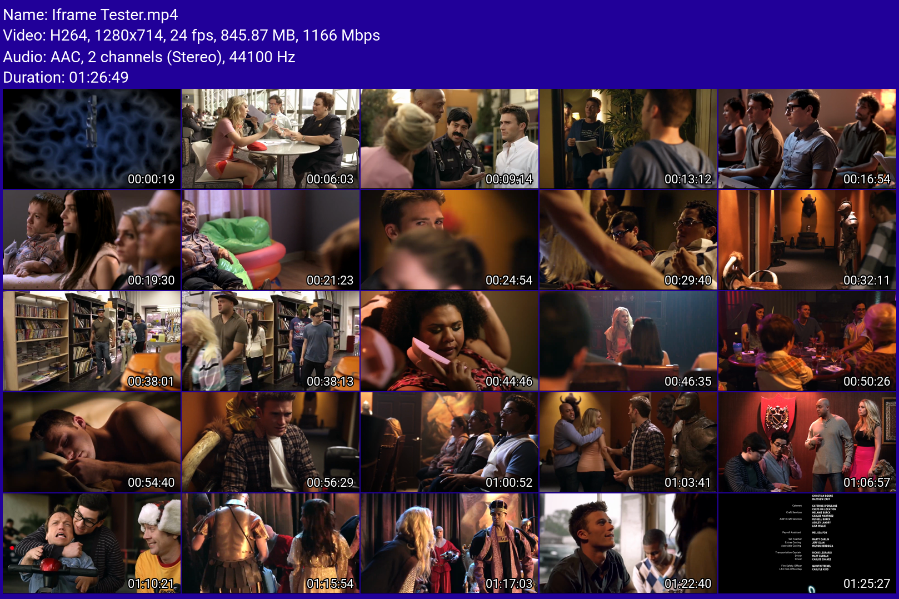

# PreviewGen - Automated Video Thumbnail Generator

## Introdução
PreviewGen é uma ferramenta full-stack para geração automática de thumbnails com customização de layout, textos e exportação de imagem com suporte amplo de formatos de vídeo. Gera thumbnails nos formatos PNG, JPEG, WebP, e conta com mecanismo de limpeza de arquivos que não fazem parte de nenhum processo em execução.

O objetivo da ferramenta é gerar previews customizados de forma rápida, satisfatória e automatizada, com interface gráfica para facilitar a usabilidade.

## Formatos suportados
Essa lista de MIME types não é definitiva e pode ser alterada facilmente em código. 
```text
video/3gpp, video/3gpp2, video/h261, video/h263, video/h264, video/iso.segment, video/jpeg, video/jpm, video/mj2, video/mp2t, video/mp4, video/mpeg, video/ogg, video/quicktime, video/vnd.dece.hd, video/vnd.dece.mobile, video/vnd.dece.mp4, video/vnd.dece.pd, video/vnd.dece.sd, video/vnd.dece.video, video/vnd.directv.mpeg, video/vnd.directv.mpeg-tts, video/vnd.dlna.mpeg-tts, video/vnd.dvb.file, video/vnd.fvt, video/vnd.mpegurl, video/vnd.ms-playready.media.pyv, video/vnd.radgamettools.bink, video/vnd.radgamettools.smacker, video/vnd.sealed.mpeg1, video/vnd.sealed.mpeg4, video/vnd.sealed.swf, video/vnd.sealedmedia.softseal.mov, video/vnd.uvvu.mp4, video/vnd.youtube.yt, video/vivo, video/webm, video/x-f4v, video/x-fli, video/x-flv, video/x-m4v, video/x-matroska, video/x-mng, video/x-ms-asf, video/x-ms-vob, video/x-ms-wm, video/x-ms-wmv, video/x-ms-wmx, video/x-ms-wvx, video/x-msvideo, video/x-sgi-movie e video/x-smv.
```

## Tecnologias
Backend: Node.js, NestJS, TypeScript.
Frontend: React.js, Tailwind CSS.
Ferramentas: Docker, Git.

## Instalação
Não é obrigatório Docker instalado para rodar esse projeto, mas é recomendado. Caso queira, é possível executar localmente trocando o comando Docker por ```npm install```e executando cada serviço manualmente.

1 - clonar
```bash
git clone https://github.com/devistto/PreviewGen.git
```
2 - abrir diretório
```bash
cd previewgen
```
3 - iniciar
```bash
docker compose up --build
```

## Variáveis de ambiente
```NODE_ENV``` — define o ambiente de execução (development/production), controlando o uso de binários locais ou do container.
```VITE_SERVER_URL```= define qual url a interface utilizará pra conexão com servidor.

## Parâmetros
Tabela para referência de campos disponíveis.
| Campo | Tipo | Descrição |
|--------|--------|------------|
| video | File | Arquivo de vídeo enviado via multipart/form-data. |
| grid | string | Quantidade de miniaturas na grade. Valores permitidos: `2x2`, `3x3`, `4x4`, `5x5`. |
| spacing | number | Espaçamento entre as miniaturas. Valores permitidos: `0`, `2`, `4`, `6`, `8`, `10`. |
| ratio | string | Proporção das miniaturas. Valores permitidos: `9:16`, `16:9`, `4:3`, `1:1`. |
| backgroundColor | string | Cor de fundo em formato hexadecimal (ex.: `#000000`). |
| textColor | string | Cor dos textos em formato hexadecimal (ex.: `#FFFFFF`). |
| font | string | Fonte utilizada nos textos. Valores permitidos: `OpenSans`, `Outfit`, `Roboto`, `PlusJakartaSans`, `Inter`. |
| timestamps | boolean | Exibe ou oculta os timestamps das miniaturas. |
| metadata | boolean | Exibe ou oculta informações adicionais do vídeo. |
| outputFormat | string | Formato da imagem gerada. Valores permitidos: `png`, `jpeg`, `webp`. |

**exemplo:**


## Nota sobre execução

Este projeto não está hospedado em produção no momento.
No entanto, pode ser executado localmente via Docker com ambiente totalmente funcional. 
Toda a pipeline de geração de thumbnails, processamento de vídeo com FFmpeg e customizações está implementada e operacional dentro do container.